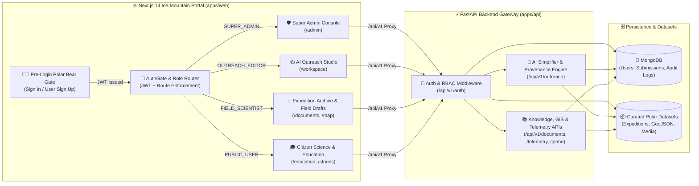

<div align="center">

# 🏔️ VISTAAR (विस्तार)
### **Integrated Polar Science Outreach, Knowledge Repository & Media Dissemination Portal**
**National Centre for Polar and Ocean Research (NCPOR) · Ministry of Earth Sciences (MoES), Government of India**  
*Smart India Hackathon (SIH) — Problem Statement #26063*

[](https://sih.gov.in)
[](https://nextjs.org/)
[](https://fastapi.tiangolo.com/)
[](https://www.mongodb.com/)
[](./SIH_REQUIREMENTS_AUDIT.md)
[](./FINAL_UI_UX_AUDIT.md)

[](https://dashboard.render.com/blueprint/new?repo=https://github.com/cryptoujjwal07/VISTAAR)

</div>

---

## 📖 Overview

**VISTAAR (विस्तार)** bridges the gap between high-impact polar research conducted at India's remote scientific bases (**Bharati**, **Maitri**, **Himadri**, **IndARC**, and **Dakshin Gangotri**) and citizens, educators, researchers, and policymakers across the nation.

Designed with an **Ice-Mountain Frosted Glassmorphic UI**, **Zero-Trust Role-Based Access Control (RBAC)**, **Cryptographic Scientific Provenance (SHA-256 + DOI verification)**, and **VSAT Low-Bandwidth Optimization ($\le 64\text{ kbps}$)**, VISTAAR transforms complex cryospheric, atmospheric, and oceanographic research into verifiable, multilingual public knowledge without compromising scientific rigor.

---

## ✨ Key Highlights & Capabilities

### 1. 🐻‍❄️ Pre-Login Polar Bear Security Gate & Ice-Mountain Glassmorphic UI
- **Mandatory Authentication Gate (`AuthGate`)**: Visiting the portal presents a full-screen **Ice-Mountain & Polar Bear Landing Page** featuring the custom `<MountainLogo />` emblem, portal mission summary, **Sign In**, and **Sign Up (User Only — Non-Admin)**.
- **Zero Unauthorized Access**: No internal pages, navigation bars, or datasets are exposed prior to authentication. Public self-registration strictly provisions `PUBLIC_USER` or `FIELD_SCIENTIST` accounts, preventing privilege escalation to `SUPER_ADMIN` or `OUTREACH_EDITOR`.
- **System-Native Typography & Frosted Glassmorphism**: Uses a high-legibility native sans-serif font stack (`-apple-system, BlinkMacSystemFont, "Segoe UI", Roboto, "Helvetica Neue", Arial, "Noto Sans", sans-serif`) paired with translucent alpine glass surfaces (`backdrop-filter: blur(22px)`).

### 2. 🔐 Strict 4-Tier Role-Based Access Control (RBAC)
Every authenticated user is automatically routed directly to their role-specific workspace upon login, with strictly filtered navigation links and backend JWT + IDOR enforcement:

| Role | Default Portal Route | Allowed Modules & Capabilities |
| :--- | :--- | :--- |
| **Super Admin** (`SUPER_ADMIN`) | `/admin` | Full system & RBAC governance, user directory management, audit logs, AI Outreach Studio (`/workspace`), and all scientific & public modules. |
| **Outreach Editor** (`OUTREACH_EDITOR`) | `/workspace` | AI Science-to-Citizen Simplifier, Hallucination Guard verification, Bilingual (Hindi/English) translation studio, Media Vault (`/media`), Stories (`/stories`), and Documents (`/documents`). |
| **Field Scientist** (`FIELD_SCIENTIST`) | `/documents` | Expedition Archive (`/documents`), GIS Map Explorer (`/map`), Live Telemetry (`/telemetry`), Media Vault (`/media`), and **IDOR-isolated Field Observation Draft Submissions** (`POST /api/v1/auth/submissions`). |
| **Public / Student** (`PUBLIC_USER`) | `/education` | Interactive Education & Citizen Science Hub (`/education`), Polar Stories (`/stories`), Media Gallery (`/media`), and Live Station Telemetry (`/telemetry`). |

### 3. 🧠 AI Science-to-Citizen Simplifier & Cryptographic Provenance
- **3-Tier Readability Transformation**: Converts dense peer-reviewed polar manuscripts into tailored summaries for **School Students (Class 8–12)**, **Policy Makers**, and **General Citizens**.
- **Automated Hallucination Guard**: Cross-checks every numerical metric, unit, and station name in the AI output against the source manuscript before publication.
- **Immutable SHA-256 Provenance**: Every published story and dataset carries a verifiable cryptographic hash (`source_sha256`), original DOI citation, and human-in-the-loop editor sign-off (`verified_by`).
- **Multilingual Dissemination**: Built-in English $\leftrightarrow$ Hindi (`हिन्दी`) scientific terminology translation aligned with GIGW 3.0 standards.

### 4. 🌍 3D Polar Globe, GIS Map Explorer & Live Station Telemetry
- **Interactive Cryosphere & Bathymetry Visualization**: Explore Antarctic (Larsemann Hills, Schirmacher Oasis), Arctic (Svalbard / Ny-Ålesund), and Himalayan (Chhota Shigri, Chandra Basin) research zones.
- **Real-Time Telemetry Stream**: Tracks surface temperature, katabatic wind speed, solar radiation, ice-core depth, and atmospheric $\text{CO}_2$ across India's polar stations.
- **Satellite / VSAT Low-Bandwidth Mode**: One-click toggle that strips heavy 3D shaders and high-resolution media streams for researchers operating over $\le 64\text{ kbps}$ polar satellite links.

---

## 🏗️ System Architecture & Workflow



### Visual Architecture & SIH Presentation Slides
| Horizontal Workflow | Technical Approach |
| :---: | :---: |
|  |  |

| Financial Feasibility | Research & References |
| :---: | :---: |
|  |  |

---

## 📂 Repository Structure

```text
VISTAAR/
├── apps/
│   ├── api/                        # FastAPI Backend (Python 3.11+, Motor Async MongoDB)
│   │   ├── core/                   # Security, JWT, CORS, Config & Database connection
│   │   ├── models/                 # Pydantic schemas & MongoDB document models
│   │   ├── routers/                # Modular API v1 endpoints (auth, documents, globe, media, etc.)
│   │   ├── services/               # AI Simplifier, Provenance verifier, Seeders
│   │   └── main.py                 # FastAPI application entrypoint
│   └── web/                        # Next.js 14 Frontend (TypeScript, Tailwind CSS, Framer Motion)
│       ├── src/app/                # App Router pages (/login, /admin, /workspace, /documents, /education, etc.)
│       ├── src/components/         # Reusable UI, AuthGate, MountainLogo, Navbar, 3D Globe
│       ├── src/context/            # AuthContext (JWT session, RBAC permissions, role home routing)
│       └── next.config.mjs         # Built-in /api/v1 reverse proxy to FastAPI backend
├── DATASETS/                       # Real NCPOR polar station telemetry, expeditions & GeoJSON datasets
├── docs/                           # Architecture, API contracts & operational documentation
├── infra/                          # Docker & Nginx production deployment configurations
├── scripts/                        # Database initialization & synthetic telemetry generators
├── tests/                          # Automated Pytest backend suite & Playwright E2E tests
└── render.yaml                     # 1-Click Render Cloud Blueprint (API + Web)
```

---

## 🚀 Getting Started (Local Development)

### Prerequisites
- **Node.js** `>= 18.x` & **npm**
- **Python** `>= 3.11`
- **MongoDB** (local instance on `mongodb://localhost:27017` or MongoDB Atlas URI)

### 1. Clone the Repository
```bash
git clone https://github.com/cryptoujjwal07/VISTAAR.git
cd VISTAAR
```

### 2. Start the FastAPI Backend (`Port 8000`)
```powershell
# Create and activate virtual environment
python -m venv .venv
.\.venv\Scripts\Activate.ps1

# Install Python dependencies
pip install -r apps/api/requirements.txt

# Launch FastAPI server (auto-seeds MongoDB with NCPOR datasets & role accounts)
python -m uvicorn apps.api.main:app --host 0.0.0.0 --port 8000 --reload
```
- **API Health Check**: `http://localhost:8000/api/v1/health`
- **Interactive Swagger Docs**: `http://localhost:8000/docs`

### 3. Start the Next.js Web Portal (`Port 3000`)
```powershell
cd apps/web
npm install
npm run dev -- --port 3000
```
- Open **`http://localhost:3000`** in your browser.
- Next.js automatically proxies all `/api/v1/*` requests to `http://127.0.0.1:8000/api/v1/*`.

---

## 🔑 Seeded Demo & Evaluation Credentials

Use the following pre-configured accounts on the Landing Page (**Sign In**) to test each role's isolated workspace, or click **Sign Up (User Only)** to register a new `PUBLIC_USER` or `FIELD_SCIENTIST` account:

| Role | Email | Password | Direct Post-Login Destination |
| :--- | :--- | :--- | :--- |
| **Super Admin** (`SUPER_ADMIN`) | `admin@vistaar.ncpor.res.in` | `VistaarAdmin@2026!` | `/admin` *(System & RBAC Command Center)* |
| **Outreach Editor** (`OUTREACH_EDITOR`) | `editor@vistaar.ncpor.res.in` | `Editor@Vistaar2026!` | `/workspace` *(AI Simplifier & Provenance Studio)* |
| **Field Scientist** (`FIELD_SCIENTIST`) | `scientist@vistaar.ncpor.res.in` | `Scientist@Vistaar2026!` | `/documents` *(Expedition Archive & Field Submissions)* |
| **Public / Student** (`PUBLIC_USER`) | `student@vistaar.ncpor.res.in` | `Student@Vistaar2026!` | `/education` *(Citizen Science & Virtual Polar Tours)* |

---

## ☁️ 5-Minute Cloud Deployment

### Option A: 1-Click Render Blueprint (Full Stack)
This repository includes a pre-configured [`render.yaml`](./render.yaml) blueprint that deploys both the **FastAPI Backend (`vistaar-api`)** and **Next.js Web Portal (`vistaar-web`)**:
1. Click the **[Deploy to Render](https://dashboard.render.com/blueprint/new?repo=https://github.com/cryptoujjwal07/VISTAAR)** button at the top of this README.
2. Provide your `MONGODB_URI` (e.g., MongoDB Atlas free cluster) and click **Apply**.

### Option B: Instant Public HTTPS Tunnel (Demo from Local Machine)
Because `apps/web/next.config.mjs` proxies `/api/v1/*` directly to the local FastAPI server, exposing port `3000` exposes the **entire full-stack application** over a single HTTPS URL:
```powershell
cloudflared tunnel --url http://localhost:3000
```

---

## 🧪 Testing & Audit Reports

Run the automated backend verification suite:
```powershell
.\.venv\Scripts\pytest.exe tests/ -v
```

Detailed compliance and engineering audit reports are available in the repository root:
- 📄 [`SIH_REQUIREMENTS_AUDIT.md`](./SIH_REQUIREMENTS_AUDIT.md) — Problem Statement #26063 Traceability Matrix
- 📄 [`SCIENTIFIC_DATA_PROVENANCE_AUDIT.md`](./SCIENTIFIC_DATA_PROVENANCE_AUDIT.md) — SHA-256 & Hallucination Guard Verification
- 📄 [`PRODUCTION_ARCHITECTURE_AUDIT.md`](./PRODUCTION_ARCHITECTURE_AUDIT.md) — Security, RBAC & Scalability Review
- 📄 [`FINAL_UI_UX_AUDIT.md`](./FINAL_UI_UX_AUDIT.md) — Ice-Mountain Glassmorphism, GIGW 3.0 & WCAG 2.1 AA Audit

---

<div align="center">
  <b>Built with ❄️ for the National Centre for Polar and Ocean Research (NCPOR) · Smart India Hackathon</b>
</div>
